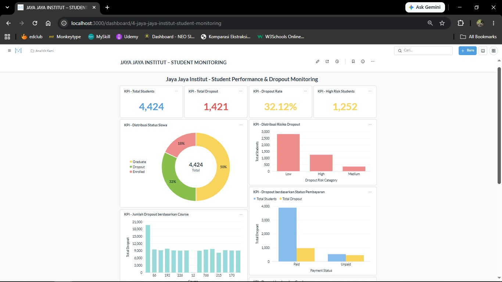
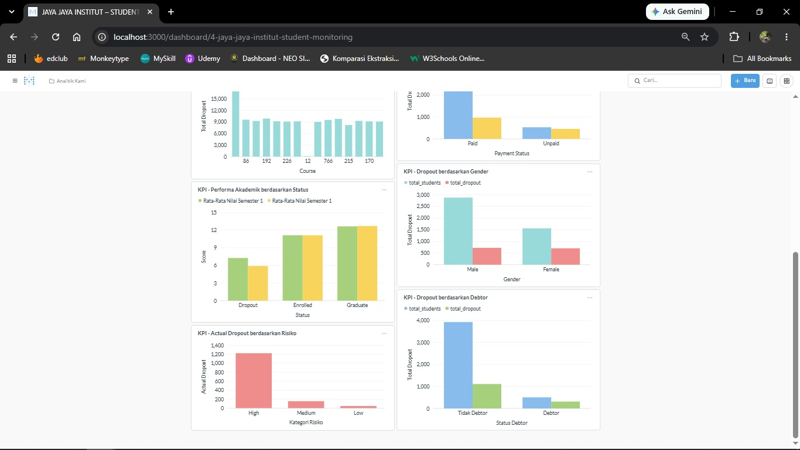

# Proyek Akhir: Menyelesaikan Permasalahan Perusahaan Edutech

## Business Understanding

Jaya Jaya Institut merupakan salah satu institusi pendidikan perguruan yang telah berdiri sejak tahun 2000. Hingga saat ini, institusi telah mencetak banyak lulusan dengan reputasi yang sangat baik. Akan tetapi, terdapat cukup banyak siswa yang tidak menyelesaikan pendidikannya alias dropout. Jumlah dropout yang tinggi merupakan masalah besar bagi sebuah institusi pendidikan, sehingga Jaya Jaya Institut ingin dapat mendeteksi secepat mungkin siswa yang berpotensi melakukan dropout agar dapat diberikan bimbingan khusus.

### Permasalahan Bisnis

Dari 4.424 mahasiswa yang tercatat, **1.421 mahasiswa (32,12%) mengalami dropout** — hampir sepertiga dari total populasi mahasiswa. Angka ini menunjukkan bahwa kehilangan mahasiswa bukan lagi kasus insidental, melainkan pola sistemik yang membutuhkan penanganan segera. Jika dibiarkan, tingginya angka dropout ini akan berdampak pada:

- **Kerugian finansial institusi** — hilangnya pendapatan dari uang kuliah mahasiswa yang tidak menyelesaikan studi, sekaligus sunk cost dari investasi sumber daya (dosen, fasilitas, program pendampingan) yang sudah dialokasikan untuk mahasiswa tersebut.
- **Penurunan reputasi dan daya saing institusi** — tingkat kelulusan yang rendah relatif terhadap jumlah mahasiswa yang diterima dapat menurunkan kepercayaan calon mahasiswa baru dan mitra industri.
- **Dampak pada akreditasi** — rasio dropout yang tinggi merupakan salah satu indikator negatif dalam penilaian akreditasi program studi maupun institusi.
- **Deteksi yang selama ini masih reaktif** — tanpa sistem peringatan dini, institusi baru menyadari risiko dropout seorang mahasiswa setelah mahasiswa tersebut benar-benar berhenti kuliah, ketika intervensi sudah terlambat dilakukan.

Kondisi ini menegaskan urgensi bagi Jaya Jaya Institut untuk memiliki **sistem deteksi dini berbasis data** yang dapat mengidentifikasi mahasiswa berisiko tinggi dropout sejak semester-semester awal, disertai **dashboard monitoring** yang memungkinkan pengambilan keputusan berbasis data secara berkelanjutan — bukan lagi berdasarkan intuisi atau laporan yang sifatnya terlambat.

### Cakupan Proyek

1. **Data Understanding & Data Preparation** — eksplorasi dan mempersiapkan dataset performa mahasiswa (`data.csv`).
2. **Predictive Modeling** — membangun model machine learning untuk memprediksi risiko dropout mahasiswa.
3. **Business Dashboard** — visualisasi interaktif (Metabase) untuk memonitor performa dan faktor-faktor terkait dropout.
4. **Prototype Machine Learning** — aplikasi Streamlit yang memungkinkan pengguna memprediksi risiko dropout mahasiswa secara individual maupun batch (CSV), di-deploy ke Streamlit Community Cloud.
5. **Kesimpulan dan Rekomendasi** — insight dan rekomendasi aksi bagi manajemen Jaya Jaya Institut.

### Persiapan

**Sumber data**: [students' performance](https://github.com/dicodingacademy/dicoding_dataset/tree/main/students_performance) — dataset performa mahasiswa Jaya Jaya Institut (4.424 baris, 36 fitur, target `Status`: Dropout/Enrolled/Graduate).

**Versi Python**: `3.13.15`

**Setup environment (menjalankan notebook & prototype):**

```bash
# 1. Buat virtual environment
python -m venv venv

# 2. Aktifkan virtual environment
# Windows:
venv\Scripts\activate
# macOS/Linux:
source venv/bin/activate

# 3. Install seluruh dependency
pip install -r requirements.txt
```

**Menjalankan notebook:**

```bash
jupyter notebook notebook.ipynb
```

Notebook juga dapat dijalankan langsung di Google Colab dengan meng-upload `notebook.ipynb` dan `data.csv`, lalu menjalankan seluruh cell secara berurutan.

**Menjalankan & mereproduksi Business Dashboard (Metabase):**

**Versi Metabase**: `v0.63.14.1` (Metabase Open Source Edition, image Docker resmi).

1. Pastikan Docker sudah terinstall dan berjalan.
2. Jalankan container Metabase dengan versi yang dipin di atas:
   ```bash
   docker run -d -p 3000:3000 --name metabase metabase/metabase:v0.63.14.1
   ```
3. Tunggu hingga container siap (cek dengan `docker logs -f metabase` sampai muncul pesan server aktif), lalu hentikan container untuk mengganti database bawaannya:
   ```bash
   docker stop metabase
   ```
4. Salin file `metabase.db.mv.db` (dari folder submission ini) ke dalam container, menimpa database bawaan:
   ```bash
   docker cp metabase.db.mv.db metabase:/metabase.db/metabase.db.mv.db
   ```
5. Jalankan kembali container:
   ```bash
   docker start metabase
   ```
6. Buka `http://localhost:3000` di browser. Dashboard yang sudah dibuat akan langsung tersedia.
7. Login menggunakan kredensial berikut:
   - Email: `root@mail.com`
   - Password: `root123`

## Business Dashboard

Business dashboard dibuat menggunakan **Metabase**, bersumber dari `students_dropout_dashboard.csv` (seluruh data mahasiswa beserta skor risiko dropout hasil prediksi model). Dashboard menampilkan KPI dan visualisasi utama untuk memonitor performa mahasiswa, di antaranya:

1. **Total Mahasiswa** dan **Jumlah/Persentase Dropout** keseluruhan.
2. **Dropout berdasarkan jumlah mata kuliah yang disetujui (approved)** di semester 1 dan 2.
3. **Dropout berdasarkan status finansial** (Debtor, Tuition fees up to date).
4. **Dropout berdasarkan status beasiswa (Scholarship holder)**.
5. **Dropout berdasarkan usia saat mendaftar (Age at enrollment)**.
6. **Distribusi kategori risiko dropout** (Low / Medium / High) hasil prediksi model.




### Tutorial Mengakses Dashboard

Ikuti langkah pada bagian **Persiapan > Menjalankan & Mereproduksi Business Dashboard (Metabase)** di atas untuk menjalankan dan mengakses dashboard secara lokal di `http://localhost:3000`, lalu login dengan:
- Email: `root@mail.com`
- Password: `root123`

## Menjalankan Sistem Machine Learning

Prototype sistem machine learning dibuat menggunakan **Streamlit** (`app.py`), dengan dua mode: input manual (satu mahasiswa) dan prediksi batch (upload CSV).

**Menjalankan secara lokal:**

```bash
streamlit run app.py
```

Aplikasi akan terbuka otomatis di browser pada `http://localhost:8501`. Pastikan folder `model/` (berisi `dropout_model.joblib`, `scaler.joblib`, `feature_columns.joblib`, `decision_threshold.joblib`) berada di direktori yang sama dengan `app.py`.

**Mengakses prototype secara online (Streamlit Community Cloud):**

🔗 [Link Prototype Streamlit](<(https://jayainstitutewiarr.streamlit.app/)>)

**Langkah deploy ke Streamlit Community Cloud:**

1. Push seluruh folder submission (minimal: `app.py`, `requirements.txt`, dan folder `model/`) ke sebuah repository GitHub.
2. Buka [share.streamlit.io](https://share.streamlit.io), login dengan akun GitHub.
3. Klik **New app**, pilih repository dan branch yang berisi `app.py`.
4. Isi **Main file path** dengan `app.py`, lalu klik **Deploy**.
5. Tunggu proses build selesai — Streamlit Cloud akan otomatis meng-install dependency dari `requirements.txt`.
6. Setelah live, salin link aplikasi dan tempelkan pada bagian "Link Prototype Streamlit" di atas.

## Conclusion

Dari 4.424 mahasiswa pada dataset, **1.421 mahasiswa (32,12%) mengalami dropout**. Model klasifikasi terbaik (Random Forest + SMOTE, dipilih otomatis melalui cross-validation di antara Logistic Regression, Random Forest, dan Gradient Boosting) mencapai **ROC-AUC ±0,93** dan **F1-score kelas Dropout ±0,82** (precision ±0,84, recall ±0,80) pada data uji — artinya model mampu membedakan mahasiswa berisiko dropout dari yang tidak dengan sangat baik, dan dari setiap 100 mahasiswa yang diprediksi berisiko dropout, ±84 di antaranya benar-benar dropout, sementara model berhasil menangkap ±80% dari seluruh mahasiswa yang benar-benar dropout.

**Fitur paling berpengaruh terhadap model** (berdasarkan feature importance) adalah jumlah mata kuliah yang disetujui/lulus (approved) di semester 1 dan 2, nilai rata-rata semester 1 dan 2, status pembayaran uang kuliah, status debtor, serta usia saat mendaftar.

**Karakteristik dan faktor penyebab mahasiswa dropout**, berdasarkan analisis data:

- **Performa akademik semester awal adalah prediktor terkuat.** Mahasiswa yang **tidak lulus satu pun mata kuliah** di semester 1 memiliki dropout rate **79,4%** (718 mahasiswa), dan yang tidak lulus satu pun di semester 2 dropout rate-nya naik menjadi **83,6%** (870 mahasiswa). Sebaliknya, mahasiswa yang lulus 5-6 mata kuliah di semester 2 dropout rate-nya hanya **10,8%**, dan yang lulus 7-8 mata kuliah hanya **6,0%**. Pola yang sama berlaku pada nilai rata-rata: mahasiswa dengan nilai rata-rata semester 2 di bawah 10 memiliki dropout rate **83,6%**, sedangkan yang bernilai 14-16 hanya **8,8%**.
- **Ketepatan pembayaran uang kuliah adalah faktor finansial paling dominan** — jauh lebih besar pengaruhnya daripada status debtor itu sendiri. Mahasiswa yang **tidak membayar uang kuliah tepat waktu** memiliki dropout rate **85,8%–87,4%** (baik berstatus debtor maupun tidak), sementara yang membayar tepat waktu dropout rate-nya turun drastis menjadi **23,8%** (non-debtor) atau **37,7%** (debtor).
- **Status beasiswa berkorelasi kuat dengan retensi** — mahasiswa penerima beasiswa memiliki dropout rate **12,2%**, jauh lebih rendah dibanding yang tidak menerima beasiswa (**38,7%**).
- **Usia saat mendaftar** — mahasiswa yang mendaftar di usia ≤20 tahun memiliki dropout rate terendah (**21,2%**), sedangkan kelompok usia 25-30 tahun memiliki dropout rate tertinggi (**59,8%**).

Secara umum, **profil mahasiswa berisiko dropout tertinggi** adalah mahasiswa yang tidak lulus mata kuliah apa pun di semester 1-2, menunggak/telat membayar uang kuliah, tidak menerima beasiswa, dan mendaftar di usia di atas 25 tahun — kombinasi faktor ini dapat mendorong probabilitas dropout ke atas 80%. Model ini memungkinkan Jaya Jaya Institut mengidentifikasi profil-profil ini sejak semester pertama, jauh sebelum mahasiswa benar-benar keluar, sehingga bimbingan khusus dapat diberikan secara proaktif dan terarah.

### Rekomendasi Action Items

1. **Terapkan sistem peringatan dini (early warning) berbasis ambang batas mata kuliah lulus semester 1.** Mahasiswa yang **tidak lulus satu pun mata kuliah pada semester 1** (dropout rate 79,4%) harus otomatis masuk kategori risiko "Sangat Tinggi" dan diwajibkan mengikuti sesi konseling akademik dalam 2 minggu pertama semester 2. Mahasiswa yang lulus 1-4 mata kuliah (dropout rate 42-71%) masuk kategori "Sedang-Tinggi" dan mendapat monitoring bulanan oleh dosen wali. Target: mahasiswa yang lulus ≥5 mata kuliah per semester (dropout rate turun ke ±11%) dianggap berada di jalur aman.
2. **Prioritaskan skema keringanan pembayaran bagi mahasiswa yang telat membayar uang kuliah**, karena keterlambatan pembayaran (bukan sekadar status debtor) adalah faktor finansial dengan dampak terbesar (dropout rate 85,8-87,4% vs 23,8-37,7% pada yang tepat waktu). Implementasi konkret: tawarkan skema cicilan otomatis begitu mahasiswa terlambat membayar lebih dari 1 bulan, sebelum keterlambatan berlanjut ke semester berikutnya.
3. **Perluas program beasiswa berbasis kebutuhan (need-based)**, khususnya bagi mahasiswa dengan kombinasi nilai akademik rendah dan kendala finansial, mengingat penerima beasiswa memiliki dropout rate 3x lebih rendah (12,2% vs 38,7%). Target implementasi: alokasikan tambahan kuota beasiswa bagi mahasiswa yang teridentifikasi kategori risiko "Sedang-Tinggi" pada poin 1 namun belum menerima bantuan finansial apa pun.
4. **Rancang program onboarding dan pendampingan khusus bagi mahasiswa yang mendaftar di usia 25-30 tahun** (dropout rate tertinggi, 59,8%), misalnya kelas persiapan akademik tambahan atau kelompok belajar sebaya (peer group) sesama mahasiswa non-tradisional, mengingat kelompok ini kemungkinan menghadapi tantangan berbeda (pekerjaan, keluarga) dibanding mahasiswa yang mendaftar di usia ≤20 tahun (dropout rate 21,2%).
5. **Operasionalkan skor risiko dropout (`DropoutRiskScore`) dari model dan dashboard sebagai bagian dari proses akademik rutin** — mahasiswa dengan kategori risiko "High" (skor ≥0,6) diprioritaskan untuk sesi konseling 1-on-1 di awal semester, sementara kategori "Medium" (skor 0,3-0,6) cukup dipantau melalui check-in berkala oleh dosen wali. Dashboard dipantau oleh tim akademik setiap awal semester untuk mengevaluasi efektivitas program intervensi dari semester ke semester.
